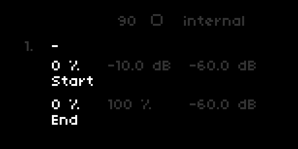

Playfaire
---

### Euclidean sequencer to play up to 8 samples simultaneously.

(blatant copy of [ash/playfair](https://github.com/tehn/ash))

[llllllll.co/t/xxx](http://llllllll.co/t/xxx)

v1.1.0

## Params

| Page    | Controller                    | Description                               | Values                         |
| ------- | ----------------------------- | ----------------------------------------- | ------------------------------ |
| All     | E1                            | Select page                               | `1` - `4`                      |
| All     | K1 + E1                       | Select track                              | `1` - `8`                      |
| All     | K2                            | Reset phase                               |                                |
| All     | K3                            | Start/Stop                                |                                |
|         |                               |                                           |                                |
| 1       | E2                            | Density / Number of triggers              |                                |
| 1       | E3                            | Length / Number of steps                  | `1` - `16`                     |
| 1       | E4                            | Multiplier / Length of step               | `1` - `16`                     |
| 1       | K1 + E2                       | Change BPM                                | `1` - `480`                    |
| 1       | K1 + E3                       | Multiplier / Length of step               | `1` - `16`                     |
|         |                               |                                           |                                |
| 2+      | K2                            | Load sample*                              |                                |
| 2       | E2                            | [selected track] Loop start               | `0` - `100` %                  |
| 2       | E3                            | [selected track] Loop end                 | `0` - `100` %                  |
|         |                               |                                           |                                |
| 3       | E2                            | [selected track] Volume                   | `-Infinity` - `0` dB           |
| 3       | E3                            | [selected track] Speed                    | `5` - `500` %                  |
|         |                               |                                           |                                |
| 4       | E2                            | [selected track] Delay send               | `-Infinity` - `0` dB           |
| 4       | E3                            | [selected track] Reverb send              | `-Infinity` - `0` dB           |

*Samples can also be added via param menu

