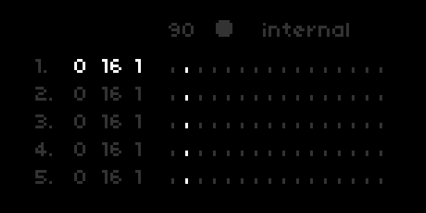

Playfaire
---

### Euclidean sequencer or a simple sequencer to play up to 8 samples simultaneously.

(blatant copy of [ash/playfair](https://github.com/tehn/ash))

[llllllll.co/t/21349](http://llllllll.co/t/21349)

v2.0.1

## Params

| Page    | Controller                    | Description                               | Values                         |
| ------- | ----------------------------- | ----------------------------------------- | ------------------------------ |
| All     | E1                            | Select track                              | 1 - 8                          |
| All     | K1 + E1                       | Change BPM                                | 20 - 400                       |
| All     | K1 + E3                       | Multiplier/Length of step                 | 1 - 16                         |
| All     | K2                            | Reset phase                               |                                |
| All     | K3                            | Start/Stop                                |                                |
|         |                               |                                           |                                |
| 1       | E2                            | Density/Number of triggers                |                                |
| 1       | E3                            | Length/Number of steps                    | 1 - 16                         |
| 1       | E4                            | Multiplier/Length of step                 | 1 - 16                         |

Add samples via param menu

### Contributors

- @tehn
- @dndrks
- @pq
- @simonvanderveldt
- @okyeron
- @justmat
- @frederickk
